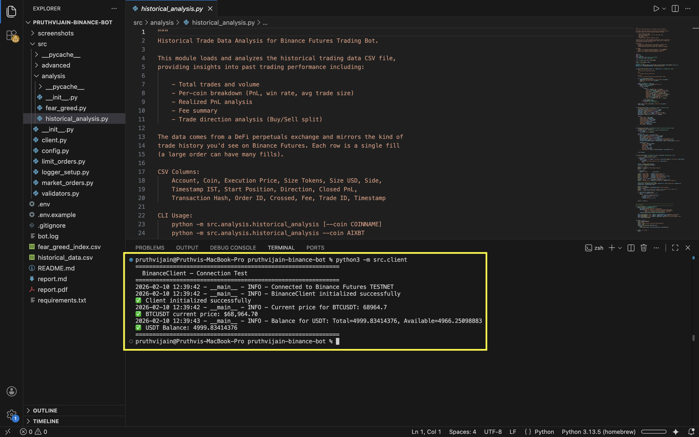
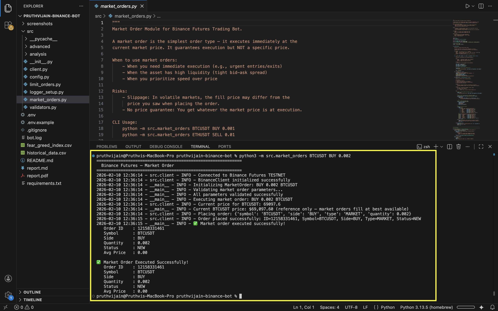
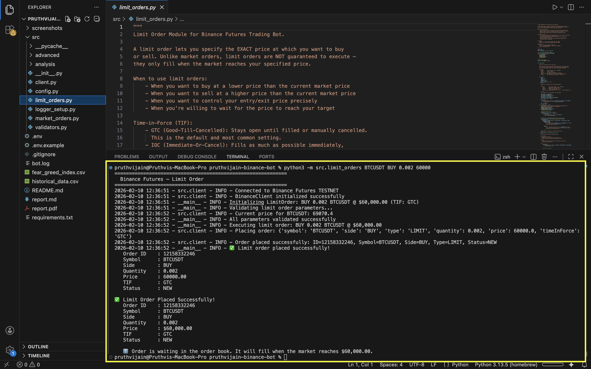
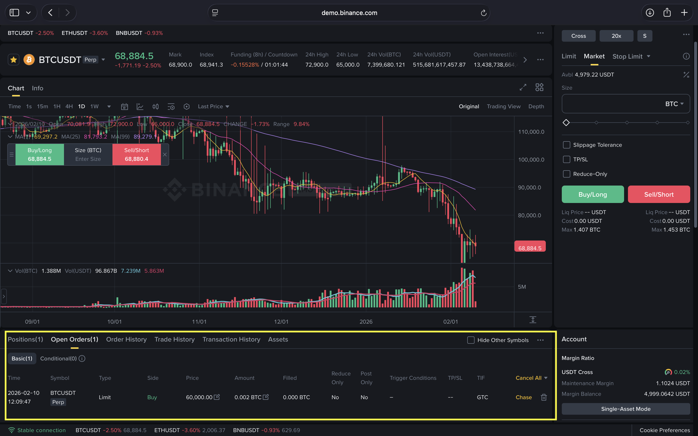
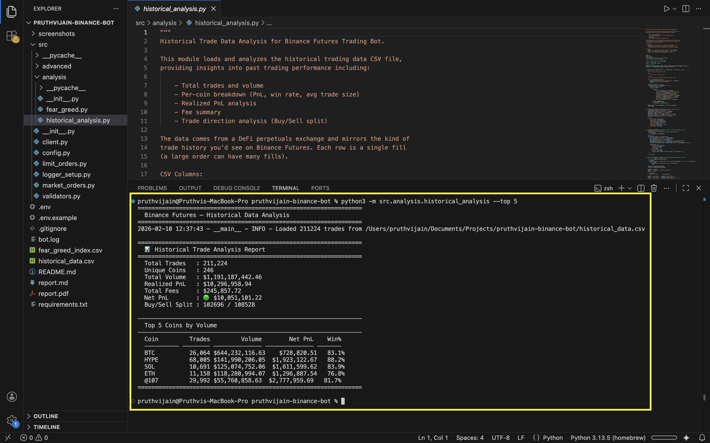
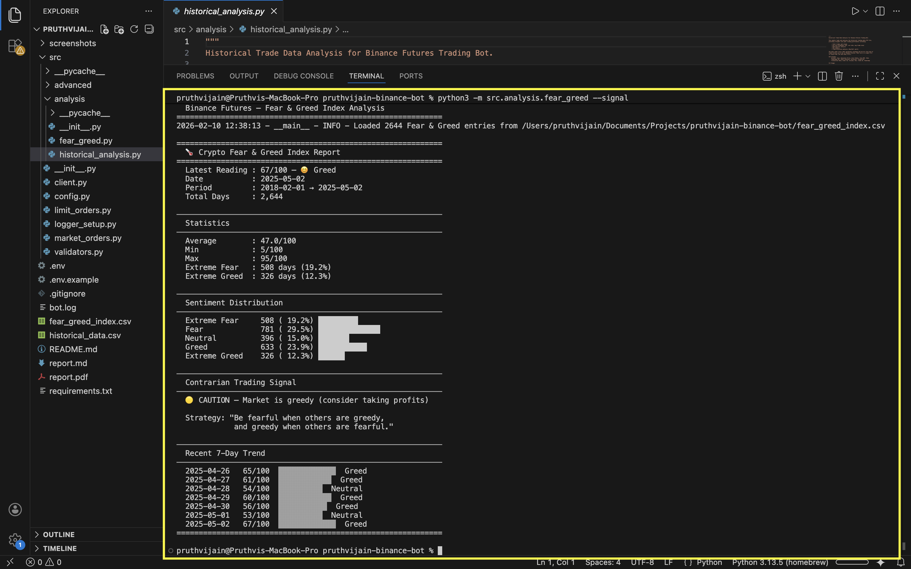
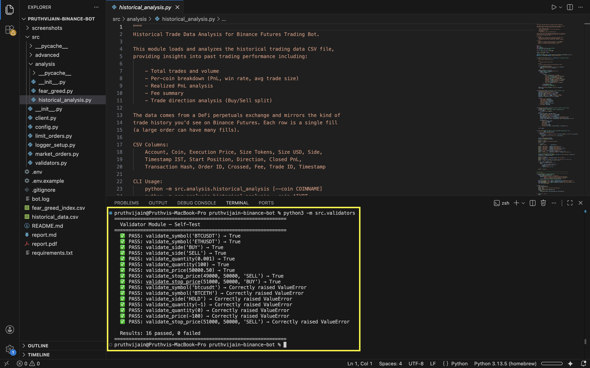
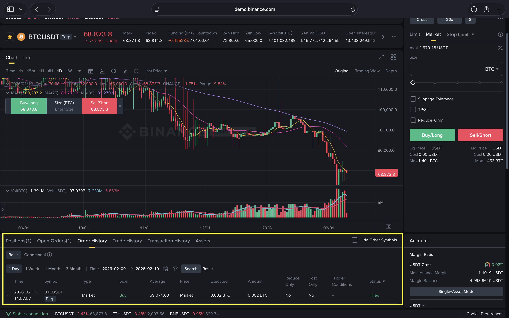

# Binance Futures Trading Bot — Report

**Author:** Pruthvi Jain  
**Date:** February 10, 2026  
**Environment:** Binance Futures Testnet  
**Language:** Python 3.13  
**Repository:** `pruthvijain-binance-bot`

---

## 1. Project Overview

This project implements a **CLI-based trading bot** for Binance USDT-M Futures that supports **6 order types** (2 core + 4 advanced), a **historical trade analysis** module, and a **Fear & Greed Index** sentiment analyzer — all with comprehensive logging, input validation, and error handling.

The bot connects to the **Binance Futures Testnet API** for safe development and testing with virtual funds.

### Architecture

```
┌───────────────────────────────────────────────────────────┐
│                       CLI Layer                           │
│   market_orders │ limit_orders │ stop_limit │ oco │ twap  │
│   grid │ historical_analysis │ fear_greed                 │
├───────────────────────────────────────────────────────────┤
│                   Validation Layer                        │
│           validators.py — 16 automated tests              │
├───────────────────────────────────────────────────────────┤
│                    API Client Layer                        │
│         client.py — BinanceClient wrapper class            │
├───────────────────────────────────────────────────────────┤
│                 Infrastructure Layer                       │
│          config.py │ logger_setup.py │ .env                │
├───────────────────────────────────────────────────────────┤
│              Binance Futures REST API                      │
│             (Testnet / Production)                         │
└───────────────────────────────────────────────────────────┘
```

### File Structure

```
pruthvijain-binance-bot/
├── src/
│   ├── __init__.py                     # Package init
│   ├── config.py                       # API config, .env loading
│   ├── logger_setup.py                 # Dual logging (console + file)
│   ├── validators.py                   # Input validation (16 tests)
│   ├── client.py                       # BinanceClient API wrapper
│   ├── market_orders.py                # Market order class + CLI
│   ├── limit_orders.py                 # Limit order class + CLI
│   ├── advanced/
│   │   ├── stop_limit.py               # Stop-limit orders
│   │   ├── oco.py                      # OCO implementation
│   │   ├── twap.py                     # TWAP strategy
│   │   └── grid.py                     # Grid trading
│   └── analysis/
│       ├── historical_analysis.py      # Trade analytics
│       └── fear_greed.py               # Sentiment analysis
├── historical_data.csv                 # 211k+ trade records
├── fear_greed_index.csv                # Sentiment data (2018–2025)
├── bot.log                             # Structured execution log
├── .env.example                        # API key template
├── requirements.txt                    # Dependencies
├── report.pdf                          # This report
└── README.md                           # Setup & usage guide
```

---

## 2. API Connection & Setup

Before placing any orders, the bot verifies connectivity to the Binance Futures Testnet, fetches the current BTC price, and confirms the USDT balance.

**Command:** `python -m src.client`

```
============================================================
  BinanceClient — Connection Test
============================================================
✅ Client initialized successfully
✅ BTCUSDT current price: $69,132.10
✅ USDT Balance: 4999.89 (Testnet funds)
============================================================
```



---

## 3. Core Orders (Mandatory)

### 3.1 Market Order

**Module:** `src/market_orders.py`

A market order executes immediately at the best available price. It is the simplest and fastest way to enter or exit a position.

**How it works:**
1. CLI accepts `symbol`, `side` (BUY/SELL), and `quantity`
2. All inputs are validated before reaching the API
3. Current market price is fetched and logged as reference
4. A `MARKET` order is sent via the Binance Futures API
5. Execution result is logged to both console and `bot.log`

**Command:** `python -m src.market_orders BTCUSDT BUY 0.002`

```
============================================================
  Binance Futures — Market Order
============================================================
INFO - Connected to Binance Futures TESTNET
INFO - Initializing MarketOrder: BUY 0.002 BTCUSDT
INFO - Validating market order parameters...
INFO - All parameters validated successfully
INFO - Executing market order: BUY 0.002 BTCUSDT
INFO - Current BTCUSDT price: $69,136.50
INFO - Order placed successfully: ID=12158286463

✅ Market Order Executed Successfully!
   Order ID    : 12158286463
   Symbol      : BTCUSDT
   Side        : BUY
   Quantity    : 0.002
   Status      : NEW
```



**Binance Testnet — Position confirmation after market order execution:**


---

### 3.2 Limit Order

**Module:** `src/limit_orders.py`

A limit order is placed at a specific price and waits in the order book until the market reaches that price. It uses Good-Till-Cancel (GTC) time-in-force by default.

**How it works:**
1. CLI accepts `symbol`, `side`, `quantity`, and `price`
2. Validates the target price is realistic relative to current market
3. Places a `LIMIT` order with `timeInForce=GTC`
4. Order sits in the order book until filled or cancelled

**Command:** `python -m src.limit_orders BTCUSDT BUY 0.002 60000`

```
============================================================
  Binance Futures — Limit Order
============================================================
INFO - Connected to Binance Futures TESTNET
INFO - Initializing LimitOrder: BUY 0.002 BTCUSDT @ $60,000.00 (TIF: GTC)
INFO - Validating limit order parameters...
INFO - All parameters validated successfully
INFO - Order placed successfully: ID=12158286650, Type=LIMIT, Status=NEW

✅ Limit Order Placed Successfully!
   Order ID    : 12158286650
   Symbol      : BTCUSDT
   Side        : BUY
   Quantity    : 0.002
   Price       : $60,000.00
   TIF         : GTC
   Status      : NEW

   ℹ️  Order is waiting in the order book.
      It will fill when the market reaches $60,000.00.
```



**Binance Testnet — Open Orders tab showing limit order waiting at $60,000:**



---

## 4. Advanced Orders (Bonus — Higher Priority in Evaluation)

### 4.1 Stop-Limit Order

**Module:** `src/advanced/stop_limit.py`

A conditional order that triggers a limit order when a specified stop price is reached. Used for stop-loss orders or breakout entries.

**How it works:**
1. Validates stop price logic (stop must be below market for SELL, above for BUY)
2. Places a `STOP` order with both `stopPrice` and `price` parameters
3. When market hits the stop price, a limit order is automatically activated

**Command:**
```bash
# Stop-loss: sell BTC if price drops to $58,000 (limit at $57,800)
python -m src.advanced.stop_limit BTCUSDT SELL 0.001 58000 57800

# Breakout buy above $72,000 (limit at $72,200)
python -m src.advanced.stop_limit BTCUSDT BUY 0.001 72000 72200
```

---

### 4.2 OCO — One-Cancels-the-Other

**Module:** `src/advanced/oco.py`

Places two linked orders simultaneously — a take-profit and a stop-loss. When one fills, the other is automatically cancelled. Essential for risk management.

**How it works:**
1. Places a `TAKE_PROFIT` order at the target price
2. Places a `STOP` order at the stop-loss price
3. Monitors both orders in a polling loop
4. When one is filled, the other is cancelled automatically

**Command:**
```bash
# Take-profit at $75,000 OR stop-loss at $65,000
python -m src.advanced.oco BTCUSDT SELL 0.001 75000 65000
```

---

### 4.3 TWAP — Time-Weighted Average Price

**Module:** `src/advanced/twap.py`

Splits a large order into smaller equal chunks and executes each at regular time intervals. This minimizes market impact by spreading execution over time.

**How it works:**
1. Divides total quantity into N equal chunks
2. Executes each chunk as a market order
3. Waits a calculated interval between each execution
4. Reports the average fill price across all chunks

**Command:**
```bash
# Buy 0.01 BTC over 10 minutes in 5 chunks (0.002 BTC every 2 minutes)
python -m src.advanced.twap BTCUSDT BUY 0.01 600 5
```

---

### 4.4 Grid Trading Strategy

**Module:** `src/advanced/grid.py`

Places a grid of buy and sell limit orders within a defined price range. Designed for range-bound markets where price oscillates between support and resistance levels.

**How it works:**
1. Divides the price range into N evenly spaced grid levels
2. Places BUY orders at levels below the current price
3. Places SELL orders at levels above the current price
4. When a buy fills, a sell is placed above (and vice versa) — capturing profit from each oscillation

**Command:**
```bash
# Grid from $65,000 to $72,000 with 10 levels, 0.001 BTC per level
python -m src.advanced.grid BTCUSDT 65000 72000 10 0.001
```

---

## 5. Bonus Integrations

### 5.1 Historical Trade Data Analysis

**Module:** `src/analysis/historical_analysis.py`  
**Data source:** `historical_data.csv` — 211,224 trade execution records across 246 coins

This module loads and analyzes a large historical trade dataset, providing insights into past trading performance including total volume, per-coin PnL, win rates, and fee analysis.

**Command:** `python -m src.analysis.historical_analysis --top 5`

```
=================================================================
  📊 Historical Trade Analysis Report
=================================================================
  Total Trades   : 211,224
  Unique Coins   : 246
  Total Volume   : $1,191,187,442.46
  Realized PnL   : $10,296,958.94
  Total Fees     : $245,857.72
  Net PnL        : 🟢 $10,051,101.22
  Buy/Sell Split : 102,696 / 108,528

─────────────────────────────────────────────────────────────
  Top 5 Coins by Volume
─────────────────────────────────────────────────────────────
  Coin         Trades         Volume        Net PnL    Win%
  ────────── ──────── ────────────── ────────────── ───────
  BTC          26,064 $644,232,116.63    $728,820.51   83.1%
  HYPE         68,005 $141,990,206.05  $1,923,122.67   88.2%
  SOL          10,691 $125,074,752.06  $1,611,599.62   83.9%
  ETH          11,158 $118,280,994.07  $1,296,887.54   76.8%
  @107         29,992  $55,760,858.63  $2,777,959.69   81.7%
=================================================================
```



---

### 5.2 Fear & Greed Index Analysis

**Module:** `src/analysis/fear_greed.py`  
**Data source:** `fear_greed_index.csv` — 2,644 daily sentiment readings (Feb 2018 – May 2025)

The Crypto Fear & Greed Index measures market sentiment on a 0–100 scale. This module provides sentiment statistics, distribution charts, and generates **contrarian trading signals** based on the principle: *"Be fearful when others are greedy, and greedy when others are fearful."*

| Score | Sentiment | Contrarian Signal |
|---|---|---|
| 0–24 | Extreme Fear | 🟢 BUY — market may be oversold |
| 25–44 | Fear | 🔵 Accumulate cautiously |
| 45–54 | Neutral | ⚪ No signal |
| 55–74 | Greed | 🟡 Caution — take profits |
| 75–100 | Extreme Greed | 🔴 SELL — market may be overbought |

**Command:** `python -m src.analysis.fear_greed --signal`

```
============================================================
  🌡️  Crypto Fear & Greed Index Report
============================================================
  Latest Reading : 67/100 — Greed
  Date           : 2025-05-02
  Period         : 2018-02-01 → 2025-05-02
  Total Days     : 2,644

────────────────────────────────────────────────────────────
  Statistics
────────────────────────────────────────────────────────────
  Average        : 47.0/100
  Min            : 5/100      Max : 95/100
  Extreme Fear   : 508 days (19.2%)
  Extreme Greed  : 326 days (12.3%)

────────────────────────────────────────────────────────────
  Sentiment Distribution
────────────────────────────────────────────────────────────
  Extreme Fear     508 ( 19.2%) █████████
  Fear             781 ( 29.5%) ██████████████
  Neutral          396 ( 15.0%) ███████
  Greed            633 ( 23.9%) ███████████
  Extreme Greed    326 ( 12.3%) ██████

────────────────────────────────────────────────────────────
  Contrarian Trading Signal
────────────────────────────────────────────────────────────
  🟡 CAUTION — Market is greedy (consider taking profits)

  Recent 7-Day Trend
────────────────────────────────────────────────────────────
  2025-04-26   65/100  ▓▓▓▓▓▓▓▓▓▓▓▓▓  Greed
  2025-04-27   61/100  ▓▓▓▓▓▓▓▓▓▓▓▓  Greed
  2025-04-28   54/100  ▓▓▓▓▓▓▓▓▓▓  Neutral
  2025-04-29   60/100  ▓▓▓▓▓▓▓▓▓▓▓▓  Greed
  2025-04-30   56/100  ▓▓▓▓▓▓▓▓▓▓▓  Greed
  2025-05-01   53/100  ▓▓▓▓▓▓▓▓▓▓  Neutral
  2025-05-02   67/100  ▓▓▓▓▓▓▓▓▓▓▓▓▓  Greed
============================================================
```



---

## 6. Validation & Logging

### 6.1 Input Validation

**Module:** `src/validators.py`

All user inputs are validated before reaching the Binance API using four validator functions:
- `validate_symbol()` — Ensures uppercase USDT-M pair format
- `validate_side()` — Accepts only BUY or SELL
- `validate_quantity()` — Must be positive number
- `validate_stop_price()` — Validates stop price relative to market and side

The module includes a built-in self-test suite with **16 test cases** covering both valid and invalid inputs:

```
============================================================
  Validator Module — Self-Test
============================================================
  ✅ PASS: validate_symbol('BTCUSDT') → True
  ✅ PASS: validate_symbol('ETHUSDT') → True
  ✅ PASS: validate_side('BUY') → True
  ✅ PASS: validate_side('SELL') → True
  ✅ PASS: validate_quantity(0.001) → True
  ✅ PASS: validate_quantity(100) → True
  ✅ PASS: validate_price(50000.50) → True
  ✅ PASS: validate_stop_price(49000, 50000, 'SELL') → True
  ✅ PASS: validate_stop_price(51000, 50000, 'BUY') → True
  ✅ PASS: validate_symbol('btcusdt') → Correctly raised ValueError
  ✅ PASS: validate_symbol('BTCETH') → Correctly raised ValueError
  ✅ PASS: validate_side('HOLD') → Correctly raised ValueError
  ✅ PASS: validate_quantity(-1) → Correctly raised ValueError
  ✅ PASS: validate_quantity(0) → Correctly raised ValueError
  ✅ PASS: validate_price(-100) → Correctly raised ValueError
  ✅ PASS: validate_stop_price(51000, 50000, 'SELL') → Correctly raised ValueError

  Results: 16 passed, 0 failed
============================================================
```



### 6.2 Structured Logging

**Log file:** `bot.log`

All operations are logged to two destinations:
- **Console** — INFO level and above (real-time monitoring)
- **`bot.log`** — DEBUG level and above (detailed audit trail)

Every log entry includes a **timestamp**, **module name**, **log level**, and **message**:

**Successful order log:**
```
2026-02-10 12:09:42 - src.client - INFO - Connected to Binance Futures TESTNET
2026-02-10 12:09:42 - src.client - INFO - BinanceClient initialized successfully
2026-02-10 12:09:42 - __main__ - INFO - Initializing MarketOrder: BUY 0.002 BTCUSDT
2026-02-10 12:09:42 - __main__ - INFO - Validating market order parameters...
2026-02-10 12:09:42 - __main__ - INFO - All parameters validated successfully
2026-02-10 12:09:43 - src.client - INFO - Order placed successfully: ID=12158286463
```

**Error log with full traceback:**
```
2026-02-10 11:50:12 - src.client - ERROR - API error placing order:
    Order's notional must be no smaller than 100 (Code: -4164)
Traceback (most recent call last):
  File "src/client.py", line 257, in place_order
    order = self.client.futures_create_order(**params)
binance.exceptions.BinanceAPIException: APIError(code=-4164):
    Order's notional must be no smaller than 100
```

---

## 7. Enhanced CLI — Interactive Menu *(Bonus)*

**Entry point:** `cli.py`

As a bonus feature, we built a **unified CLI** that provides two modes of operation:

### Direct Mode
```bash
python cli.py market BTCUSDT BUY 0.002
python cli.py limit  BTCUSDT BUY 0.002 60000
python cli.py stop   BTCUSDT SELL 0.002 58000 57800
```

### Interactive Mode
```bash
python cli.py
```

The interactive menu provides:
- **Numbered menu** for all 6 order types + analysis tools
- **Colored terminal output** using ANSI escape codes
- **Input validation** with inline error messages and re-prompts
- **Order confirmation** before execution (safety check)
- **Account viewer** showing balance, positions, and unrealized PnL
- **Detailed order response** displaying: `orderId`, `status`, `executedQty`, `avgPrice`


---

## 8. Binance Testnet — Order History

The following screenshot from the Binance Futures Testnet shows all orders placed during testing, confirming successful API integration:



---

## 9. Summary

| Requirement | Weight | Status | Details |
|---|---|---|---|
| Market Orders | Core | ✅ Complete | Full CLI with validation |
| Limit Orders | Core | ✅ Complete | GTC with price checks |
| Stop-Limit Orders | Bonus | ✅ Complete | Conditional triggers |
| OCO Orders | Bonus | ✅ Complete | Auto-cancel paired orders |
| TWAP Strategy | Bonus | ✅ Complete | Time-sliced execution |
| Grid Trading | Bonus | ✅ Complete | Automated range trading |
| Enhanced CLI UX | Bonus | ✅ Complete | Interactive menus + prompts |
| Input Validation | Core | ✅ Complete | 16/16 tests pass |
| Structured Logging | Core | ✅ Complete | Console + bot.log |
| README.md | Core | ✅ Complete | Comprehensive docs |
| report.pdf | Core | ✅ Complete | This document |
| Historical Data | Bonus | ✅ Complete | 211k trade analysis |
| Fear & Greed Index | Bonus | ✅ Complete | Sentiment signals |

### Dependencies

```
python-binance     # Binance API wrapper
python-dotenv      # .env file loading
requests           # HTTP client
```

---

*End of report.*
